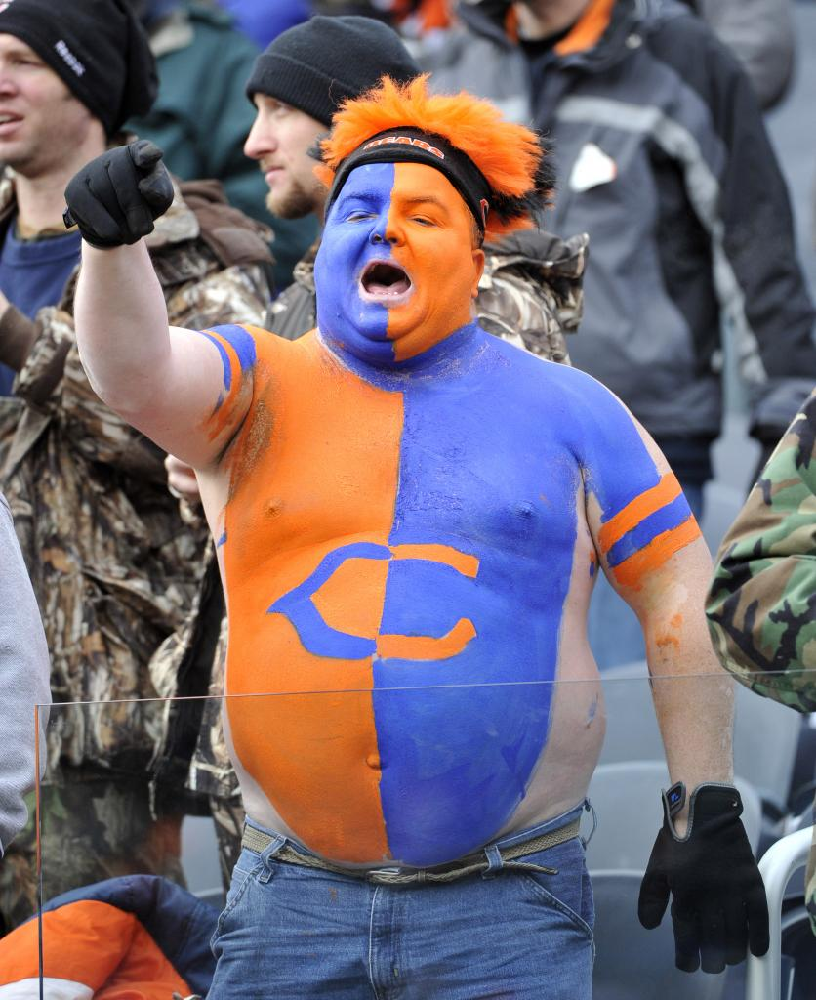
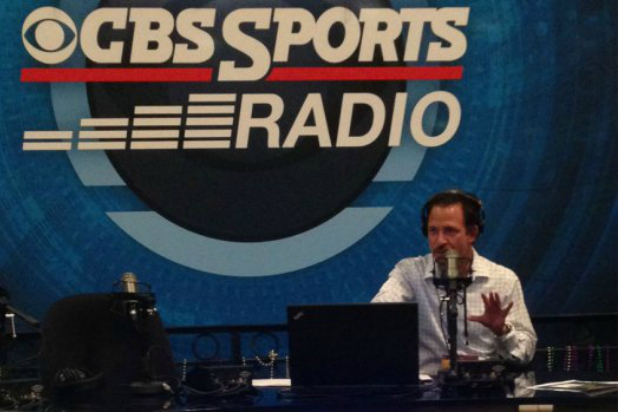

# 3 Personas
## Sports Podcast Lover 

## Crazy Sports Fan

## Competing Sports podcaster 

# David 
## Bio 
David loves listening to sports podcast each day, during his bike rides. He is a DePaul University college student majoring in Journalism. He loves sports podcast which are entertaining and funny.
## Goals 
Find a local sports podcast besides Barstool Sports. Also, find a podcast which caters to local Chicago colleges 
## Frustrations
He's frustrated with having to rely on national podcasters to cover Chicago colleges. He needs a podcast which isn't too long like the normal podcast which are longer than one hour
## Motivations
He always wants to be the friend in his group who knows the most about sports. He wants to be able to be on top of all the conversations, during breaks at work.
# James 
## Bio
James has been a Chicago bears fan since he could walk and talk. He's been a Bears season ticket-holder since 1989. He is passionate about the Bears and once missed his daughters birthday party to attend a game.
## Goals
James is looking for a podcast, which will keep him up-to-date during the Chicago Bears daily transactions and offseason moves
## Frustrations 
He dislikes the mainstream sports radio personalities, who aren't covering the Chicago Bears avidly and speak badly about the team. He wants a objective but informed perspective of the Bears team on a bi-weekly basis.
## Motivations
When James knows more about the Bears, he's in a happy mood. James, also loves food and tailgating before games 
# Jim 
## Bio
Jim is a distinguished sports journalist and radio personality in sports radio. He has held an illustrius career, holding positions at ESPN and CBS radio.
# Goals
Jim goals are always to engage his radio listenes with compelling and thought provoking content.
## Frustration
Jim is often frustrated when he doesn't have a in-depth persepective to look to when he's covering a local team topic. He often doesn't have reliable sources to run to for beat coverage. 
## Motivations
Jim wants to remain as one of the top listened to sports radio personalities in the nation. 
# Features of the Sports Network
## Notifications when a new shows are uploaded online
Bi-Weekly podcast
## Interview local sports athletes and entrepreneurs
